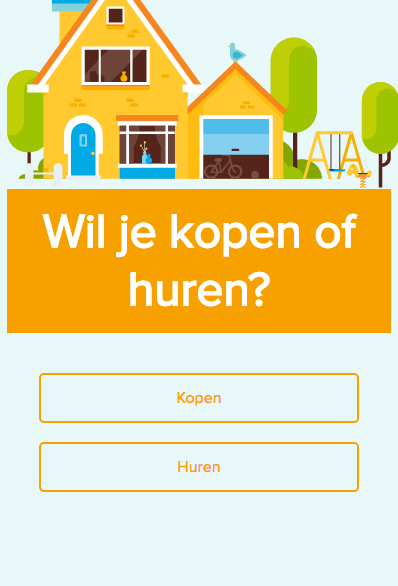
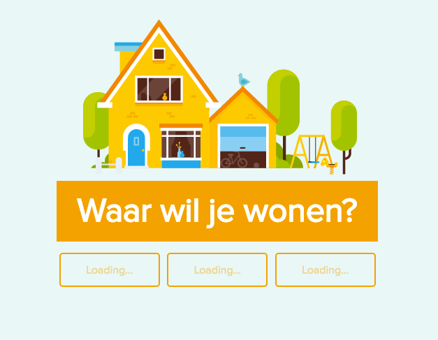
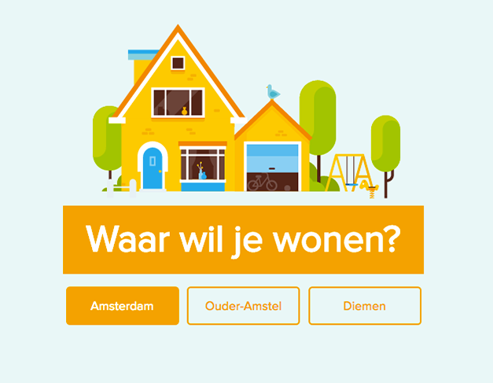
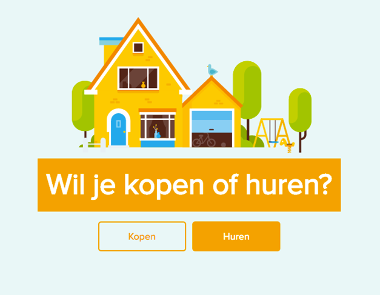
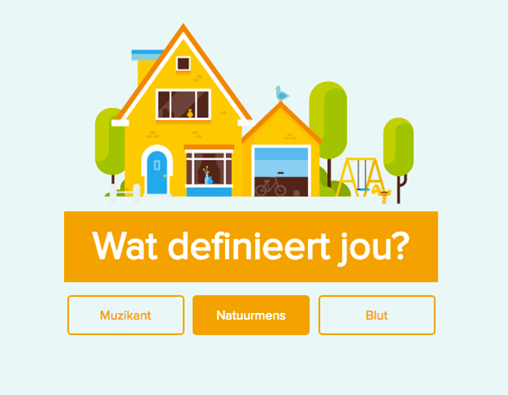
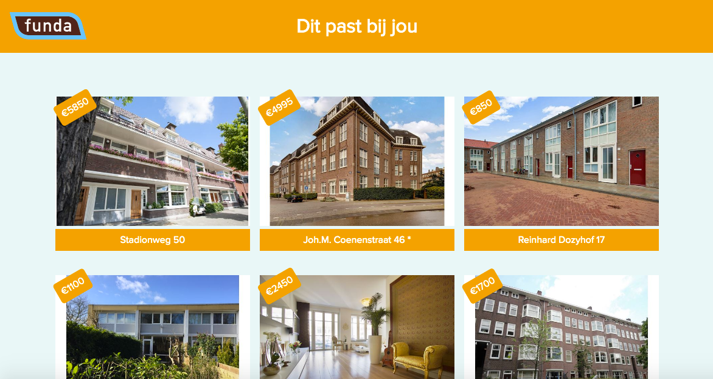
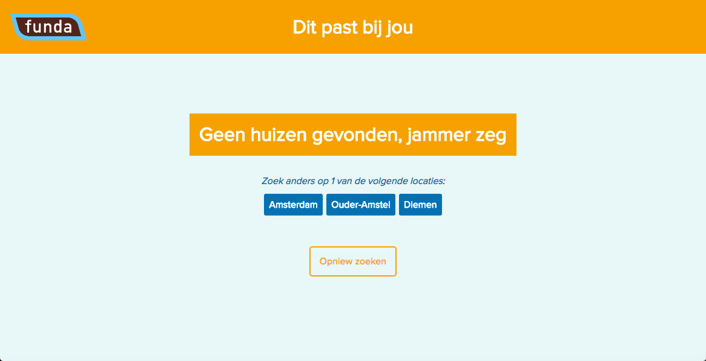

# minor-funda
Assignment for Funda made in 4 days.

##Link to js
<a href="https://github.com/lhafkamp/minor-funda/blob/master/assets/js/script.js">
https://github.com/lhafkamp/minor-funda/blob/master/assets/js/script.js</a>

##Who is Funda?
Funda is a <a href="http://www.funda.nl/">website</a> where the user can find a new place to live.

##What did I do?

 
 
I made an alternative filter method where the users answer questions in order to find the house that suits their needs. This solution is made for users that don't have the ability or time to find specific filters on the Funda site.

##API's that I used
- Funda's API to get the data from the houses in their database
- the GeoNames API to get the cities within your radius
- the native Geolocation API to get the current position (longitude/latitude) of the user

##Wishlist
Since this was merely a prototype to show the concept I would have expanded it by making it more detailed and by adding more questions in order to get the correct results. The native Geolocation also doesn't work on mobile because its currently not under a https server.

##The app
###Finds 3 cities near you depending on your location

###Filters on your selected city
 
###Filters on wether you want to buy or rent a house

###Filters on whatever defines you the most

###Shows the results

###Whenever there are no results
